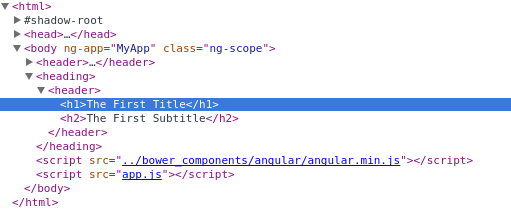

# The Template

The first step towards building our directive is to set up the basic JavaScript scaffolding and add a template to it. That's what we'll do in this lesson.



Par défaut le tag heading qui sert de directive est gardé dans le DOM

Pour le remplacer par son template il faut ajouter l'attribut **replace: true** a la directive

```javascript
return {
    replace: true, // <-- here
    template: '<header><h1>The First Title</h1><h2>The First Subtitle</h2></header>'
};
```

replace fonctionne seulement si on a un seul root élément (ici on a strong et header)
```javascript
return {
    replace: true, // <-- ne fonctionne pas
    template: '<strong>Strong text</strong><header><h1>The First Title</h1><h2>The First Subtitle</h2></header>'
};
```
